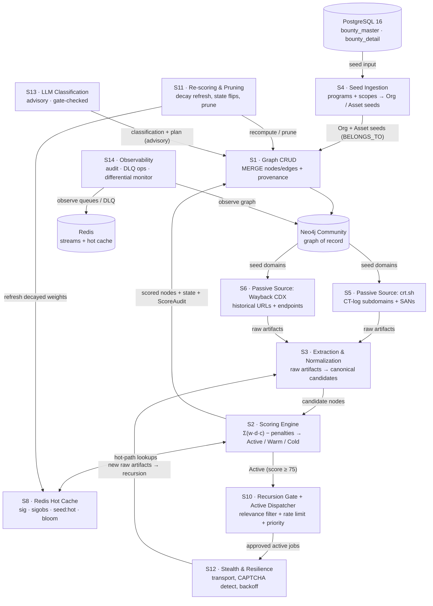
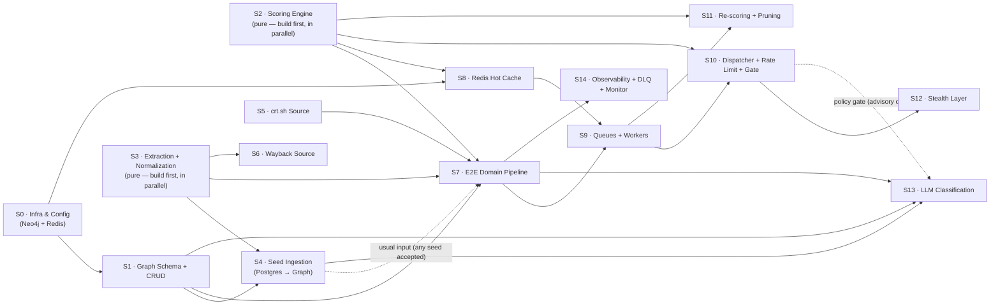
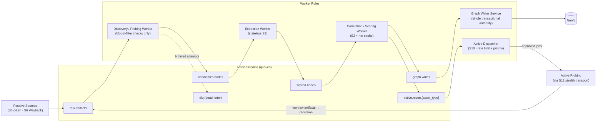
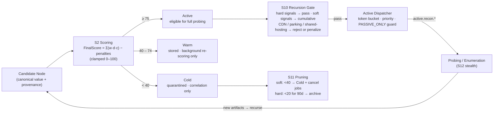

# Recon Pipeline — Flow Diagrams

**Sources:** [`recon.md`](./recon.md) (ASM spec) · [`../recon-pipeline/IMPLEMENTATION_PLAN.md`](../recon-pipeline/IMPLEMENTATION_PLAN.md) (15-stage plan)

This doc visualizes the Attackbot_v2 recon pipeline as a set of Mermaid diagrams.
**Rendering:** VS Code (Markdown preview / `Ctrl+Shift+V`) and GitHub render Mermaid natively.

---

## 1. Component Glossary (who is who)

| # | Component | Stage | Role in the system | Proposed home |
|---|-----------|-------|--------------------|---------------|
| — | **PostgreSQL 16** | existing | Source of seed data (HackerOne programs, scopes, weaknesses) | `db/` |
| — | **Neo4j Community** | S0/S1 | **Graph of record** — every node/edge with provenance | `shared/graph.py` |
| — | **Redis** | S0/S8/S9 | **Queues** (Streams) + **hot cache** (scores) | `shared/redis_client.py` |
| **Seed Ingestion** | S4 | Reads Postgres → creates `Organization` + `Asset` seed nodes | `pipeline/seeds.py` |
| **crt.sh Source** | S5 | CT-log subdomain/SAN enumeration + wildcard detection | `sources/crtsh.py`, `sources/dns.py` |
| **Wayback Source** | S6 | Historical URL harvest via CDX API | `sources/wayback.py` |
| **Extraction & Normalization** | S3 | Raw artifacts → **canonical candidate nodes** + `content_hash` | `extract/` |
| **Scoring Engine** | S2 | `FinalScore = Σ(w·d·c) − penalties` → Active/Warm/Cold + `ScoreAudit` | `scoring/` |
| **Graph CRUD** | S1 | Idempotent `MERGE` of nodes/edges, constraints, indexes | `graph/` |
| **Hot Cache** | S8 | Derived score cache for fast hot-path reads | `queue/` (cache layer) |
| **Queue Workers** | S9 | Redis Streams consumer groups; 5 worker roles | `queue/` |
| **Recursion Gate + Dispatcher** | S10 | Relevance filter (hard/soft signals), token-bucket rate limiting, priority | `pipeline/gate.py` |
| **Stealth & Resilience** | S12 | Transport adapter, CAPTCHA detection, backoff, source quarantine | `stealth/` |
| **Re-scoring & Pruning** | S11 | Decay refresh, state flips, job cancel, archive | `pipeline/` (rescore loop) |
| **LLM Classification** | S13 | Advisory classification + recon plan (Cerebras / Groq fallback) | `llm/classifier.py` |
| **Observability** | S14 | Score audit, DLQ ops, differential monitoring | `observability/` |

---

## 2. End-to-End Runtime Flow (v1)

The v1 loop: **seed → passive source → extract → score → write → recurse**.

> **Note:** S9 (Queue Workers) is the async execution layer that runs the S5→S3→S2→S1 loop as Redis Streams consumers instead of a single sequential runner — see Diagram 4.

---

## 3. Stage Build Order (Dependency DAG)

From the plan's authoritative dependency table (§6). Dashed lines = **not** a hard dependency.

**Key takeaways:**
- **S2 & S3 are pure and dependency-free** → build them first, in parallel with S0/S1.
- **Longest critical path:** `S0 → S1 → S4 → S7 → S8 → S9 → S10 → S11 → S14`.
- S4 is a *convenient input* to S7, not a hard dependency (runner accepts manual/fixture seeds).

---

## 4. Queue & Worker Topology (S9)

Decouples high-throughput discovery from expensive correlation (spec §8).

---

## 5. Candidate Lifecycle & the Recursion Gate

**Lifecycle invariants (from the spec):**
- Every edge & score carries **provenance** `(source, tool, observed_at, confidence)`.
- Every graph write is an idempotent **`MERGE`** on `(asset_type, canonical_value)`; raw artifacts carry `content_hash`.
- **Nothing active runs without passing the S10 gate** + rate limiter; `PASSIVE_ONLY` degrades the whole system to passive.
- LLM output (S13) is **advisory** — it can never authorize active work by itself.
- Cache (S8) is **derived**, never authoritative — a wipe loses nothing.
