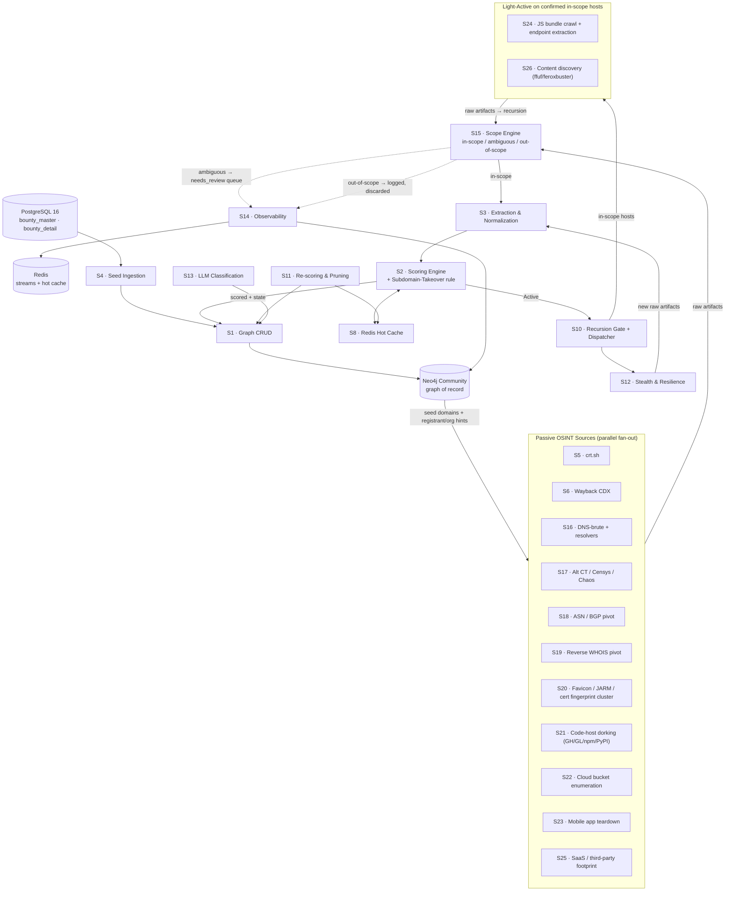
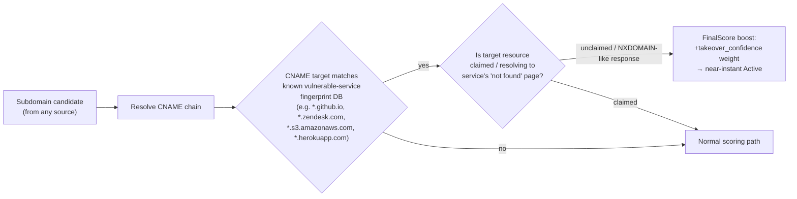

# Recon Pipeline v2 — Maximizing Attack Surface (Scope-Bound)

**Base:** [`recon_flow.md`](recon_flow.md) (Attackbot_v2, S0–S14)
**Goal of this revision:** add the passive OSINT source classes that most bug-bounty programs
explicitly *permit* and that materially widen discovered surface — **without** turning the
pipeline into an out-of-scope scanner. Every new source is a **passive/OSINT node feeding S3**,
gated the same way S5/S6 already are: nothing reaches active probing (S12) without S2 scoring
→ S10 gate → dispatcher token bucket. That gate is the actual safety and legal boundary of this
system — the additions below only make it *see more*, not *hit harder or hit out-of-policy*.

---

## 0. Ground rule this revision enforces everywhere

> **Scope Engine (new, sits in front of S1 writes) — every candidate node, from every source,
> must resolve to an `Organization`/`Asset` that matches an in-scope pattern from the program's
> Postgres scope table (S4) *before* it is allowed past S3 into S2 scoring.** Out-of-scope
> matches are logged (for context/pivoting notes) but flagged `OUT_OF_SCOPE` and excluded from
> S10/S12 entirely. This is what lets you "widen maximally" safely: you can pull in ASN-level,
> registrant-level, and third-party data, and the Scope Engine is the single choke point that
> keeps active work inside the rules of engagement.

This is a new mandatory component: **S15 · Scope Engine** (`pipeline/scope.py`), consuming the
same Postgres scope rows S4 reads, exposing `is_in_scope(candidate) -> bool | ambiguous`. Anything
`ambiguous` (e.g., shared hosting, CDN IP, wildcard-adjacent) goes to a `needs_review` queue for a
human triage step — never auto-promoted to Active.

---

## 1. New Passive Source Classes (feed into S3, same as crt.sh/Wayback)

| # | Source | What it adds to surface | Data → candidate type | Notes |
|---|--------|--------------------------|------------------------|-------|
| S5 | crt.sh (existing) | CT-log subdomains/SANs | `Subdomain`, `Wildcard` | — |
| S6 | Wayback CDX (existing) | Historical URLs/endpoints | `URL`, `Endpoint`, `Parameter` | — |
| **S16** | **DNS-brute + resolvers** (`shuffledns`/`puredns` + trusted resolver list) | Subdomains missed by CT logs (no cert issued, internal-only names leaked via other sources) | `Subdomain` | Wordlists seeded from S6 endpoint paths + industry-specific terms |
| **S17** | **Alt CT/aggregator APIs** (crt.sh mirrors, `Censys`, `chaos` dataset if program is in ProjectDiscovery Chaos) | Redundancy for CT enumeration; catches certs crt.sh missed during outages | `Subdomain`, `SAN` | Cheap, high dedup rate with S5 — keep as a fallback/merge source, not primary |
| **S18** | **ASN / BGP pivot** (`bgp.he.net`, RIPEstat, `ASN` from resolved IPs of confirmed in-scope assets) | Entire IP ranges owned by the org — catches infra with no DNS record at all | `IPRange`, `IP` | High false-positive risk on cloud/shared ASNs (AWS/GCP/Azure) — Scope Engine must special-case cloud ASNs as `ambiguous`, not auto-in-scope |
| **S19** | **Reverse WHOIS / registrant pivot** (via WHOIS history APIs on registrant org/email from confirmed root domains) | Sibling domains under the same legal entity, incl. rebrands, regional TLDs, forgotten assets | `Domain` | Registrant data is increasingly redacted (GDPR/WHOIS privacy) — treat as a **best-effort enrichment**, expect low yield on modern registrations |
| **S20** | **Favicon hash / JARM / TLS-cert fingerprint clustering** (`mmh3` favicon hash, `JARM`, cert Subject/Issuer/SAN reuse) | Infrastructure sharing a fingerprint with a *confirmed* in-scope asset — finds unlinked-by-DNS but same-owner hosts (via Shodan/Censys/FOFA search on the hash) | `IP`, `Host` | Fingerprint match is a *hint*, not proof of ownership — always routes through Scope Engine as `ambiguous` until corroborated (shared cert CN, shared org string in TLS cert, etc.) |
| **S21** | **GitHub / GitLab / npm / PyPI dorking** (org repos, employee repos, leaked configs, `.env`, API base URLs in code, subdomains in CI configs) | Endpoints, internal hostnames, API keys/tokens (→ separate `Secret` node type, never logged in plaintext), tech-stack fingerprints | `Endpoint`, `Subdomain`, `Secret`(hashed/redacted), `Technology` | Respect program scope for "employee OSINT" — many programs explicitly exclude social-engineering/employee-targeting; keep this source strictly to *code artifacts*, not personal info |
| **S22** | **Cloud storage bucket enumeration** (permutation of org name/brand against S3/GCS/Azure Blob naming conventions, informed by S6 URLs referencing bucket hostnames) | Misconfigured public buckets — very common high-signal bounty win | `CloudAsset` | Passive: only *check public listing*, never write/delete objects; anything requiring auth stays out of scope |
| **S23** | **Mobile app teardown** (APK/IPA from Play Store/App Store, static-decompile for hardcoded API hosts, embedded keys) | API endpoints not exposed on web surface, internal/staging hostnames | `Endpoint`, `Subdomain`, `Secret` | Fully passive (public app binaries); dynamic/runtime testing of the app itself is out of this pipeline's scope unless program explicitly includes mobile |
| **S24** | **JS bundle crawling & endpoint extraction** (recursive crawl of confirmed in-scope hosts, extract `fetch`/`axios`/API paths from bundled JS via `LinkFinder`/`JSluice`-style regex + AST parsing) | Hidden API routes, internal parameter names, feature-flagged endpoints | `Endpoint`, `Parameter` | This is *active* HTTP fetching of already-in-scope hosts (like a crawler), so it runs *after* Scope Engine confirms the host — feeds back into S3 like S5/S6 |
| **S25** | **SaaS / third-party footprint** (SPF/DMARC records, MX providers, `Have I Been Pwned` domain search, Shodan `org:`/`ssl:` search, cloud provider tags) | Confirms which SaaS the org depends on (helps prioritize S13 classification, e.g. "uses Zendesk" → check for subdomain takeover on `orgname.zendesk.com`) | `Technology`, `ThirdPartyService` | Feeds a **Subdomain Takeover** detector (new correlation rule in S2, see §3) |
| **S26** | **Content-Discovery on confirmed hosts** (`ffuf`/`feroxbuster` with curated wordlists, informed by S6 historical paths + S21/S24 discovered paths) | Hidden admin panels, backup files, forgotten staging paths on already-in-scope hosts | `Endpoint`, `Asset` | Active (sends requests) — routed through S10/S12 exactly like existing active probing, rate-limited per-host |

**Placement in the pipeline:** S16–S23, S25 are pure passive OSINT and slot in parallel to S5/S6,
all feeding S3 → Scope Engine → S2. S24 and S26 are *light active* (crawling/fuzzing already-
confirmed in-scope hosts) and are routed exactly like the existing S12 stealth-probing path, so
they inherit rate-limiting, CAPTCHA backoff, and quarantine for free.

---

## 2. Updated End-to-End Flow

---

## 3. New Correlation Rule: Subdomain Takeover Detector (extends S2)

A very high-signal, low-noise class of finding that a widened-surface pipeline should surface
automatically rather than rely on manual spotting:

Fingerprint DB should be sourced from the actively maintained community list
(`can-i-take-over-xyz`-style) and refreshed periodically — service takeover signatures change as
providers patch them.

---

## 4. Scope Engine Decision Table (S15)

| Input signal | Decision | Rationale |
|---|---|---|
| Resolves to domain/subdomain matching a program scope regex | `in_scope` | Direct match |
| Resolves to IP inside a program-listed CIDR (from S4 scope data) | `in_scope` | Direct match |
| Resolves to IP inside ASN pivot (S18) result, ASN is dedicated to the org (not cloud-shared) | `in_scope` (auto) | Org-owned infra block |
| Resolves to IP inside ASN pivot result, ASN is AWS/GCP/Azure/Cloudflare/Akamai/etc. | `ambiguous` → needs_review | Shared infra — could be anyone's tenant |
| Favicon/JARM/cert fingerprint match only (S20), no DNS/WHOIS corroboration | `ambiguous` → needs_review | Fingerprint reuse is not proof of ownership |
| Reverse-WHOIS registrant match (S19), no other corroboration | `ambiguous` → needs_review | Registrant orgs can be shared registrars/proxies |
| Explicit program exclusion (wildcard exclusion, named out-of-scope subsidiary) | `out_of_scope` (hard block) | Program says no — full stop, never overridden by any score |
| Third-party SaaS tenant (S25) not owned by org, no takeover signal | `out_of_scope` | Testing a vendor's infra isn't testing the target, unless takeover-vulnerable and program allows subdomain-takeover class |

`needs_review` items surface in S14's observability dashboard with the evidence chain
(which source, which corroborating signals) so a human can promote/reject in seconds rather than
re-deriving the reasoning.

---

## 5. Updated Stage Build Order

Add to the dependency DAG from `recon_flow.md` §3:

- `S4 --> S15` (Scope Engine needs the scope table S4 already loads)
- `S15 --> S3` (S3 only processes scope-cleared candidates)
- `S16, S17, S18, S19, S20, S21, S22, S23, S25 --> S15` (all new passive sources feed the gate, mirroring how S5/S6 feed S3 today)
- `S10 --> S24`, `S10 --> S26` (light-active sources are dispatched exactly like existing active probing)
- `S24, S26 --> S15` (recursion re-enters through the gate, not directly into S3)

Critical path is unchanged (`S0→S1→S4→S7→S8→S9→S10→S11→S14`); the new sources parallelize
alongside S5/S6 and add width, not pipeline depth.

---

## 6. Rollout Priority (highest surface-per-effort first)

1. **S20 (favicon/JARM/cert clustering)** + **S18 (ASN pivot)** — cheapest to implement (mostly API calls to Shodan/Censys/RIPEstat), historically the highest yield of "forgotten" infra in wide-scope programs.
2. **S25 (SaaS footprint) + Subdomain-Takeover rule** — very high signal-to-noise, directly produces reportable findings, not just surface.
3. **S21 (code-host dorking)** — high value but needs careful secret-handling (hash/redact before graph write, never store raw tokens/keys in Neo4j — write a `Secret{hash, source, redacted_preview}` node and alert S14 instead).
4. **S22 (cloud bucket enum)** — cheap, permutation-based, passive-only (list operation, no writes).
5. **S16/S17 (DNS-brute + alt CT)** — incremental over existing S5, good redundancy investment.
6. **S23 (mobile teardown)** — higher engineering cost (APK/IPA acquisition + decompilation pipeline); worth it once program scope explicitly includes mobile apps or you observe mobile-only APIs referenced elsewhere.
7. **S19 (reverse WHOIS)** — lowest expected yield on modern targets (WHOIS privacy is near-universal now) but cheap to bolt on as a long-tail enrichment.
8. **S24/S26 (light-active crawl/fuzz)** — do these *last*, only once S15/S10/S12 gating is solid, since they generate real traffic against target infrastructure.

---

## 7. What did *not* change (and why)

- **The S10 gate + rate limiter remains the sole authorization path to active work.** Widening
  sources widens what *can* be discovered, not what's allowed to be *hit*. This is the actual
  legal/ethical safety mechanism in the original design, and it stays untouched.
- **LLM Classification (S13) stays advisory-only.** More sources means more volume for S13 to
  triage into recon plans, but it still cannot authorize action by itself.
- **No new component performs credential use, exploitation, or destructive testing.** Bucket
  enumeration is list-only; secret discovery redacts and alerts rather than using found
  credentials; takeover detection identifies dangling records, it does not claim them.
